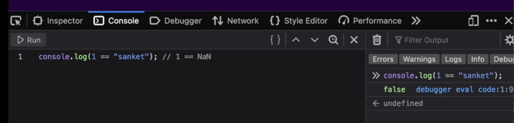
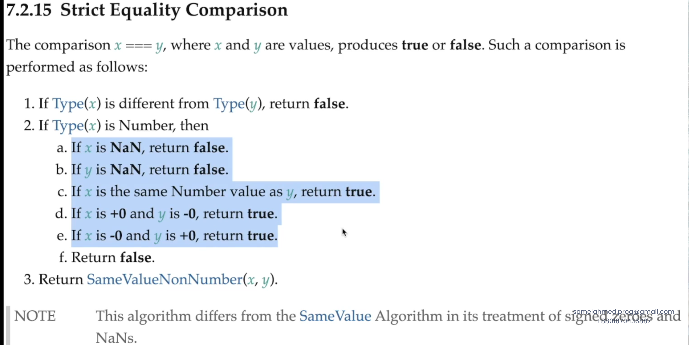

# JavaScript Equality Operators

A comprehensive guide to understanding `==` and `===` in JavaScript.

---

## Table of Contents

- [Abstract Equality Operator (`==`)](#abstract-equality-operator-)
- [Strict Equality Operator (`===`)](#strict-equality-operator-)
- [Key Differences](#key-differences)
- [Examples](#examples)
- [Best Practices](#best-practices)

---

## Abstract Equality Operator (`==`)

### How It Works

The abstract equality operator performs **type coercion** before comparison.

**Algorithm:**
1. ✅ Checks if both operands have the **same type**
2. **If types are same** → performs strict equality comparison
3. **If types are different** → converts (coerces) one or both operands to the same type, then compares values

### Examples
```javascript
// Same type - direct comparison
5 == 5                 // true

// Different types - type coercion occurs
5 == "5"               // true  → "5" converted to number 5
0 == false             // true  → false converted to 0
"" == false            // true  → both convert to 0
null == undefined      // true  → special case
```

### Type Coercion Rules

| Comparison | Coercion Result | Output |
|------------|----------------|--------|
| `5 == "5"` | `"5"` → `5` | `true` |
| `0 == false` | `false` → `0` | `true` |
| `"" == 0` | `""` → `0` | `true` |
| `null == undefined` | No conversion | `true` |

---

## Strict Equality Operator (`===`)

### How It Works

The strict equality operator does **NOT** perform type coercion.

**Algorithm:**
1. ✅ Checks if both operands have the **same type**
2. **If types are different** → immediately returns `false` ❌
3. **If types are same** → compares the actual values

### Examples
```javascript
// Same type and value
5 === 5                // true

// Different types - no coercion, immediate false
5 === "5"              // false → number vs string
0 === false            // false → number vs boolean
"" === false           // false → string vs boolean
null === undefined     // false → null vs undefined
```

---

## Key Differences

| Feature | `==` (Abstract) | `===` (Strict) |
|---------|----------------|----------------|
| **Type Checking** | ✅ Yes | ✅ Yes |
| **Type Coercion** | ✅ Yes | ❌ No |
| **Performance** | Slower (coercion overhead) | Faster |
| **Predictability** | Less predictable | More predictable |

### Side-by-Side Comparison
```javascript
// Abstract Equality (==)
"5" == 5               // true  ✅ (coercion happens)
0 == false             // true  ✅ (coercion happens)
"" == 0                // true  ✅ (coercion happens)
null == undefined      // true  ✅ (special rule)

// Strict Equality (===)
"5" === 5              // false ❌ (no coercion)
0 === false            // false ❌ (no coercion)
"" === 0               // false ❌ (no coercion)
null === undefined     // false ❌ (different types)
```

---

## Examples

### Common Pitfalls with `==`
```javascript
// Unexpected truthy comparisons
[] == false            // true  ⚠️
[] == ![]              // true  ⚠️ (confusing!)
"0" == false           // true  ⚠️

// Safer with ===
[] === false           // false ✅
"0" === false          // false ✅
```

### When to Use Each
```javascript
// ❌ Avoid == (can cause bugs)
if (userInput == 0) {
  // This matches 0, "0", false, "", etc.
}

// ✅ Prefer === (explicit and safe)
if (userInput === 0) {
  // This ONLY matches the number 0
}

// ⚠️ Exception: Checking for null/undefined
if (value == null) {
  // Matches both null and undefined (sometimes useful)
}

// Equivalent strict version
if (value === null || value === undefined) {
  // More explicit, same result
}
```

---

## Best Practices

### ✅ Do

- **Always use `===`** unless you have a specific reason not to
- Use `===` for predictable, bug-free code
- Be explicit about your type comparisons
```javascript
const age = 25;
if (age === 25) {  // ✅ Good
  console.log("Age is exactly 25");
}
```

### ❌ Don't

- Avoid using `==` in most cases
- Don't rely on implicit type coercion
- Don't mix types when comparing
```javascript
const age = 25;
if (age == "25") {  // ❌ Bad (works but unclear)
  console.log("This works but is confusing");
}
```

---

## Summary

> **TL;DR:** Use `===` (strict equality) by default. It's safer, more predictable, and prevents type coercion bugs. Only use `==` when you explicitly need type coercion behavior.

---

## Resources

- [MDN: Equality comparisons](https://developer.mozilla.org/en-US/docs/Web/JavaScript/Equality_comparisons_and_sameness)
- [JavaScript.info: Comparisons](https://javascript.info/comparison)

---



## License

This documentation is for educational purposes.